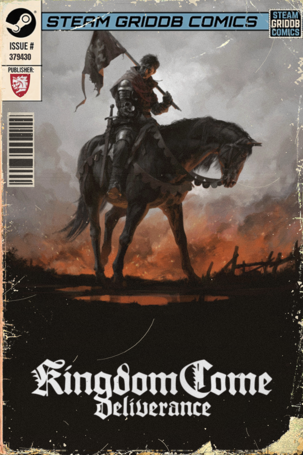
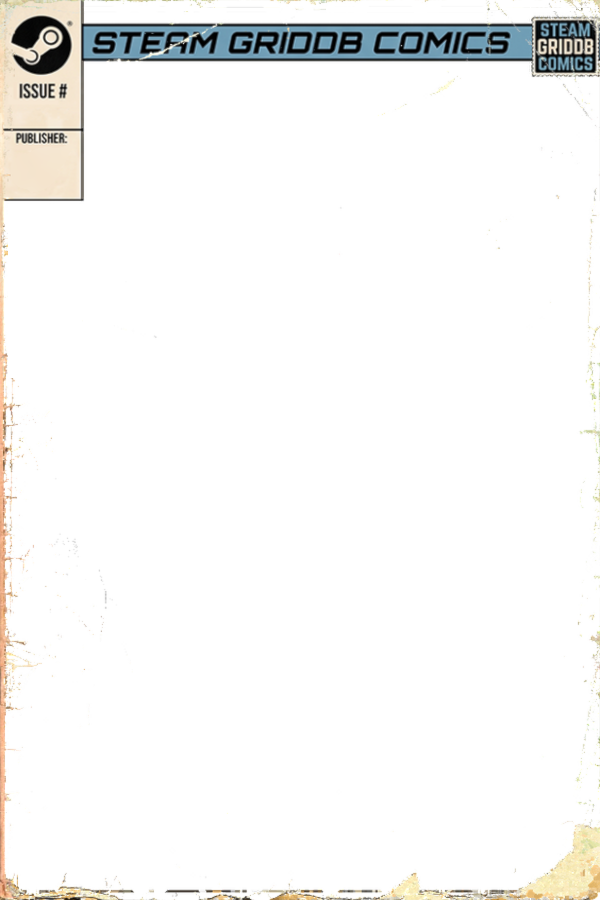

<div align="center">
  
  <h1>Steam GridDB Cover Maker</h1>
  <p><strong>Gera capas de quadrinho vintage para os seus jogos no Steam, no estilo Steam GridDB Comics.</strong></p>

  
  
  
  
</div>

---

## ✨ O que é isso?

O **Cover Maker** transforma arte de qualquer jogo em uma capa de gibi envelheci­da, pronta pra subir no [SteamGridDB](https://www.steamgriddb.com/) como grid vertical. Você entra com três imagens e um Steam ID, e sai com um PNG profissional de 600 × 900 px.

<div align="center">
  
  <br/>
  <sub><i>Kingdom Come: Deliverance · Steam ID 379430</i></sub>
</div>

---

## 🎨 Funcionalidades

| Feature | Detalhe |
|---|---|
| **Template "STEAM GRIDDB COMICS"** | Moldura pré-envelhecida com logotipo, caixa de issue e barcode lateral |
| **Desgaste procedural** | Ruído fractal + manchas de papel + lascas simuladas individualmente para arte, logo do jogo e publisher |
| **Código de barras dinâmico** | Gerado a partir do Steam ID — diferente pra cada jogo |
| **Semente determinística** | Usar o Steam ID como seed garante que o mesmo jogo sempre produza o mesmo desgaste |
| **Auto-contraste das logos** | Sombra/contorno automático quando a logo tem baixo contraste com a arte de fundo |
| **Pan & Zoom** | Enquadramento livre da arte de fundo e da logo da publisher |
| **Prévia ao vivo** | Preview em tempo real (400 ms de debounce) enquanto você ajusta os sliders |
| **Saída full-res** | PNG 600 × 900 px salvo direto na pasta do executável |
| **Abre o gerenciador de arquivos** | Após salvar, abre o Explorer na pasta para você renomear na hora |

---

## 🖥️ Interface

A janela tem dois painéis:

- **Esquerda — Arquivos Base:** selecione as 3 imagens e digite o Steam ID. Botão **Editar** expande as opções avançadas (zoom, pan, desgaste).
- **Direita — Prévia ao Vivo:** mostra a capa renderizada em escala menor enquanto você ajusta tudo.

---

## 🚀 Como usar

### Opção 1 — Executável (Windows)

Baixe `CoverMaker.exe` na aba [Releases](../../releases) e execute. Não precisa instalar Python nem nenhuma biblioteca.

### Opção 2 — Rodar pelo Python

```bash
# 1. Clone o repositório
git clone https://github.com/seu-usuario/cover-maker.git
cd cover-maker

# 2. Instale as dependências
pip install pillow numpy customtkinter

# 3. Execute
python gerador_capas.py
```

---

## 📥 Entradas necessárias

| Campo | Descrição |
|---|---|
| **Arte de fundo** | Qualquer imagem do jogo (PNG, JPG, WEBP…) |
| **Logo do jogo** | Logotipo preferencialmente com fundo transparente (PNG) |
| **Logo da publisher** | Logotipo da publisher/estúdio (PNG com transparência) |
| **Steam ID** | ID numérico do jogo no Steam — vira o número do issue e a semente do desgaste |

> **Dica:** Para achar o Steam ID, acesse a página do jogo na Steam Store. O número está na URL: `store.steampowered.com/app/**379430**/Kingdom_Come_Deliverance/`

---

## 🗂️ Estrutura do projeto

```
cover-maker/
├── gerador_capas.py      # Script principal
├── template.png          # Molde da capa (600 × 900, RGBA)
├── Anton-Regular.ttf     # Fonte do número do issue
├── docs/
│   ├── amostra.png       # Exemplo de capa gerada
│   ├── template.png      # Prévia do template em branco
│   └── icon.png          # Ícone do aplicativo
└── dist/
    └── CoverMaker.exe    # Executável Windows (gerado pelo build)
```

---

## 🔧 Gerar o `.exe` você mesmo

```bash
pip install pyinstaller

pyinstaller --noconfirm --onefile --windowed \
  --name=CoverMaker \
  --add-data="template.png;." \
  --add-data="Anton-Regular.ttf;." \
  --collect-all=customtkinter \
  gerador_capas.py
```

O executável final fica em `dist/CoverMaker.exe`.

---

## 📄 Template

<div align="center">
  
  <br/>
  <sub><i>template.png — molde transparente 600 × 900 px</i></sub>
</div>

O template já contém: cabeçalho "STEAM GRIDDB COMICS", logo Steam, caixas de issue e publisher, e bordas envelhecidas. Você substitui apenas a área central (arte) e os elementos dinâmicos (logos, número, barcode).

---

## 🙏 Créditos

- Template e estética inspirados no estilo **Steam GridDB Comics** da comunidade [SteamGridDB](https://www.steamgriddb.com/)
- Fonte **Anton Regular** — [Google Fonts](https://fonts.google.com/specimen/Anton) (OFL)

---

<div align="center">
  Feito com Python + Pillow + CustomTkinter &nbsp;|&nbsp; Exporta em 600 × 900 px
</div>